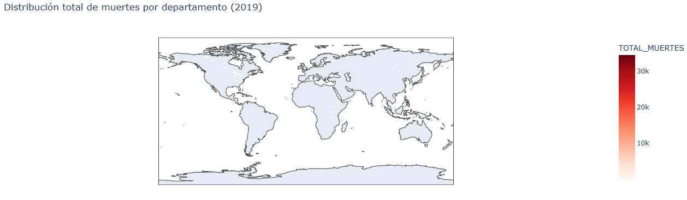
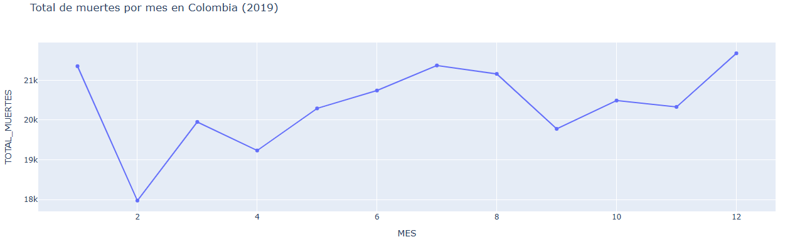
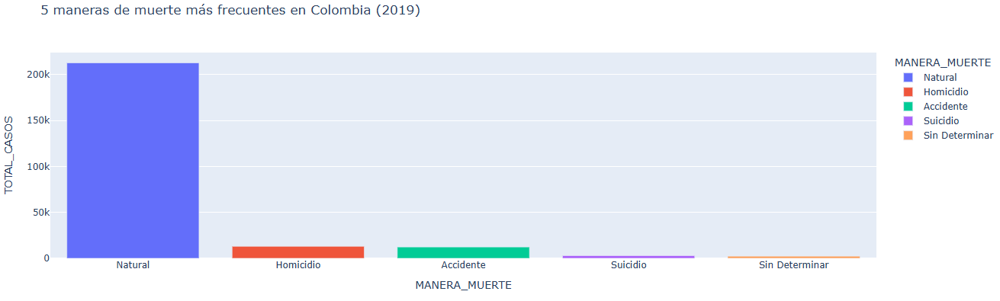
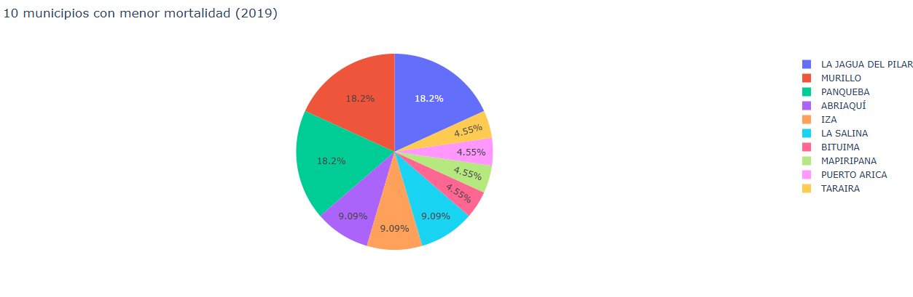
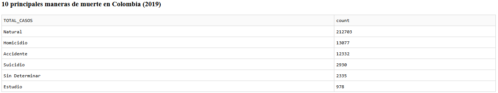
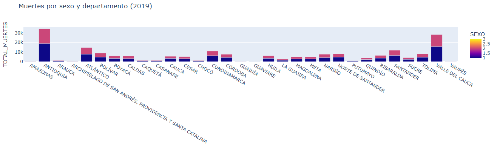
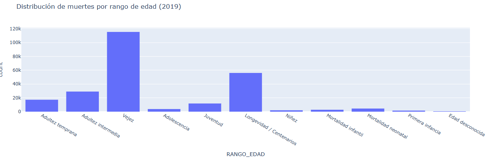

Análisis de Mortalidad en Colombia – 2019

Introducción del proyecto
Esta aplicación web dinámica fue desarrollada en Python utilizando las librerías Dash y Plotly, con el propósito de analizar la mortalidad en Colombia durante el año 2019.
El sistema integra reportes interactivos que permiten visualizar patrones demográficos, geográficos y de causas de muerte, brindando una herramienta accesible para la exploración visual y el análisis de datos oficiales.

Objetivo
El objetivo de la aplicación es facilitar la interpretación de los datos de mortalidad en Colombia, mediante gráficos interactivos que muestren tendencias por mes, diferencias por sexo, distribución por departamento y principales causas o maneras de muerte.
Además, busca promover el uso de herramientas de analítica visual en la toma de decisiones relacionadas con salud pública y demografía.

Estructura del proyecto
mortalidad-colombia/
│
├── appweb.py                # Archivo principal de la aplicación Dash
├── requirements.txt         # Dependencias necesarias para ejecutar la app
├── Anexo1.NoFetal2019_CE_15-03-23.xlsx   # Datos de mortalidad (DANE)
├── Anexo2.CodigosDeMuerte_CE_15-03-23.xlsx  # Nombres de las causas de muerte
├── Divipola_CE_.xlsx        # División político-administrativa (DANE)
├── README.md                # Descripción y documentación del proyecto
└── (otros archivos auxiliares)

Requisitos
| Librería | Versión sugerida |
| -------- | ---------------- |
| dash     | ≥ 2.18           |
| plotly   | ≥ 5.24           |
| pandas   | ≥ 2.2            |
| openpyxl | ≥ 3.1            |
| gunicorn | ≥ 21.2           |

Despliegue (Render)
Plataforma: Render.com

Pasos seguidos:

Subida del proyecto completo a un repositorio público en GitHub.

Conexión del repositorio a Render con la opción “New Web Service”.

Configuración del entorno Python con los comandos:

Build command: pip install -r requirements.txt

Start command: gunicorn appweb:app

Despliegue automático desde la rama main.

Acceso público a la aplicación en:
https://mortalidad-colombia-fz86.onrender.com/

Software utilizado
Lenguaje: Python 3.13

Framework: Dash (Plotly)

Bibliotecas: Pandas, OpenPyXL, Plotly Express

Control de versiones: Git y GitHub

Despliegue en la nube: Render (PaaS)

Entorno de desarrollo: Visual Studio Code

Instalación local
Clonar el repositorio:

git clone https://github.com/iareyesmolina-max/mortalidad-colombia.git
cd mortalidad-colombia

Crear un entorno virtual e instalar dependencias:

python -m venv venv
venv\Scripts\activate
pip install -r requirements.txt

Ejecutar la aplicación:

python appweb.py

Abrir el navegador en:

http://127.0.0.1:8050/

Visualizaciones y resultados

Mapa: Distribución de muertes por departamento

Representa el total de muertes registradas en cada departamento de Colombia. Los tonos rojos más intensos indican mayor mortalidad (Antioquia, Valle, Cundinamarca).

Nota: Durante el despliegue en Render, la visualización del mapa mundial no mostró correctamente los límites geográficos de los departamentos de Colombia. Esto se debe a que la versión actual del código utiliza un gráfico de tipo choropleth sin un archivo GeoJSON local con las coordenadas de cada departamento. La funcionalidad general del gráfico se mantiene (distribución total de muertes por departamento), pero el mapa se muestra a nivel global.

Gráfico de líneas: Muertes por mes

Permite observar la variación mensual de las muertes a lo largo del año 2019, mostrando ligeros picos en los meses finales.

Gráfico de barras: Maneras de muerte más frecuentes

Destaca las cinco causas principales (por ejemplo, causas naturales, accidentes, agresiones, entre otras).

Gráfico circular: Municipios con menor mortalidad

Muestra las diez localidades con menor cantidad de casos registrados durante el año.

Tabla: Principales maneras de muerte

Lista los códigos y descripciones más frecuentes junto con su número total de casos.

Gráfico de barras apiladas: Muertes por sexo y departamento

Compara la mortalidad de hombres y mujeres en cada departamento, identificando diferencias notables.

Histograma: Distribución por grupo de edad

Agrupa la mortalidad según rangos etarios, permitiendo identificar los grupos más afectados.